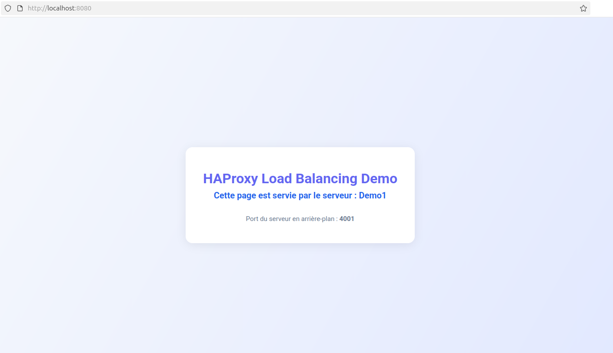
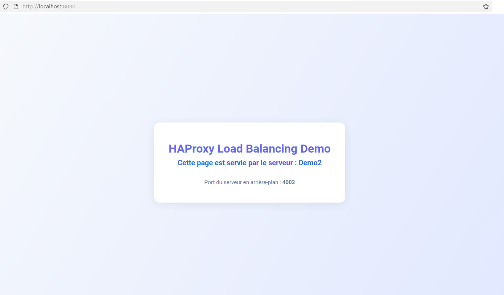
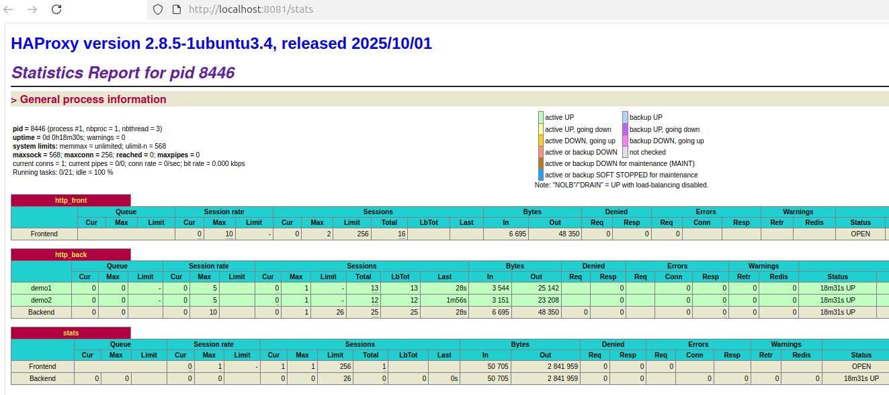

# Documentation du Projet Load Balancing Node.js + HAProxy - TP2 - Question 2

## Auteurs
Joris Felzines et Stéphane Falciola

## Introduction et description du système
Ce projet, réalisé dans le cadre du TP2 d'Infonuagique (8INF876 - UQAC), illustre les principes fondamentaux de l'équilibrage de charge HTTP à l'aide de HAProxy et de serveurs Node.js. L'objectif est de montrer comment répartir efficacement le trafic entre plusieurs instances d'une application web pour garantir la haute disponibilité et la fiabilité du service.

Deux serveurs Node.js identiques (`demo_server.js`) sont lancés sur des ports différents. HAProxy agit comme répartiteur de charge en dirigeant les requêtes entrantes vers l'un ou l'autre serveur selon une stratégie round-robin. Un script d'automatisation (`setup_and_test.sh`) permet de tout installer, configurer et tester automatiquement sur Ubuntu.

## Description de l'architecture de l'application

### Code source
L'application est composée des fichiers principaux suivants :
- `demo_server.js` : Serveur Node.js permettant de savoir quel serveur répond à la requête
- `setup_and_test.sh` : Script shell pour installer Node.js, HAProxy, lancer les serveurs et configurer le load balancing

### Fonctionnement du load balancing
- Deux instances de `demo_server.js` sont lancées sur les ports 4001 et 4002
- HAProxy écoute sur le port 8080 et répartit les requêtes HTTP entre les deux serveurs
- La page de statistiques HAProxy est accessible sur le port 8081

## Déploiement et utilisation

### Installation et lancement automatisés sur Ubuntu
1. Cloner le projet et se placer dans le dossier :
   ```sh
   git clone https://github.com/Ereguof/Infonuagique-Load-Balancing.git
   cd Infonuagique-Load-Balancing
   ```
   Ou mettez les fichiers manuellement dans un répertoire de votre choix.
2. Lancer le script d'installation et de test :
   ```sh
   bash setup_and_test.sh
   ```
   Ce script :
   - Installe Node.js, npm et HAProxy
   - Démarre deux serveurs Node.js sur les ports 4001 et 4002
   - Configure HAProxy pour répartir le trafic
   - Exécute un test automatique pour vérifier l'équilibrage de charge
   - Affiche le lien vers la page de statistiques HAProxy

## Guide utilisateur
1. Accédez à l'URL locale [http://localhost:8080](http://localhost:8080) pour voir la page web load balancée.
   
2. Rafraîchissez la page plusieurs fois : le nom du serveur affiché change à chaque requête, illustrant l'équilibrage de charge.
   
3. On peut surveiller la répartition et l'état des serveurs via la page de statistiques HAProxy : [http://localhost:8081/stats](http://localhost:8081/stats)
   

### Arrêt des serveurs
```sh
pkill -f demo_server.js
```